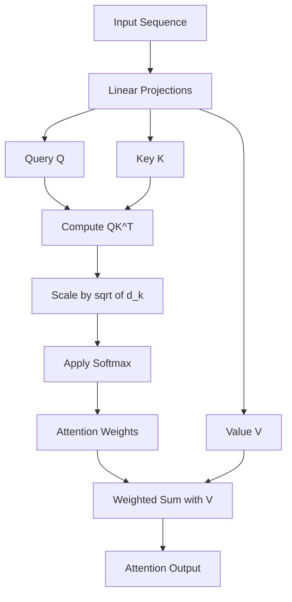
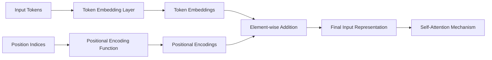

# Task 2: Transformer Networks and Applications in Cybersecurity

## Part A: Transformer Network Architecture

### Introduction to Transformers

A **Transformer** is a neural network architecture introduced by Vaswani et al. in the seminal 2017 paper "Attention is All You Need." Unlike traditional sequence modeling architectures such as Recurrent Neural Networks (RNNs) and Long Short-Term Memory (LSTM) networks, Transformers rely entirely on attention mechanisms to capture dependencies between input and output sequences. This revolutionary design eliminates the need for sequential processing, enabling full parallelization during training and achieving state-of-the-art performance across numerous natural language processing and sequence-based tasks.

### Motivation: Limitations of RNNs and CNNs

Traditional sequence modeling approaches face significant computational and representational limitations:

**Recurrent Neural Networks (RNNs):**
- **Sequential Processing Constraint**: RNNs process tokens one at a time, preventing parallel computation and resulting in slow training on long sequences.
- **Vanishing Gradient Problem**: Information from distant tokens becomes diluted through repeated matrix multiplications, limiting the effective context window.
- **Long-Range Dependency Challenges**: Despite improvements like LSTM and GRU units, capturing dependencies spanning hundreds of tokens remains difficult.

**Convolutional Neural Networks (CNNs):**
- **Fixed Receptive Fields**: CNNs require stacking multiple layers to capture long-range dependencies, increasing model depth and computational cost.
- **Local Context Bias**: Convolutions inherently focus on local patterns, making global relationship modeling inefficient.

Transformers address these limitations by computing attention weights between all pairs of positions simultaneously, enabling direct modeling of long-range dependencies with constant path length and full parallelization.

### Encoder-Decoder Architecture

The Transformer follows an encoder-decoder structure designed for sequence-to-sequence tasks:

**Encoder:**
- Consists of N identical layers (typically N=6)
- Each layer contains two sub-layers:
  1. Multi-head self-attention mechanism
  2. Position-wise fully connected feed-forward network
- Processes the entire input sequence in parallel
- Generates contextualized representations for each input token

**Decoder:**
- Also composed of N identical layers
- Contains three sub-layers per layer:
  1. Masked multi-head self-attention (prevents attending to future positions)
  2. Multi-head cross-attention over encoder outputs
  3. Position-wise feed-forward network
- Generates output sequence autoregressively

Both encoder and decoder employ residual connections around each sub-layer, followed by layer normalization.

### Self-Attention Mechanism

Self-attention is the core innovation enabling Transformers to model relationships between all positions in a sequence simultaneously.

**Query, Key, and Value Vectors:**

For each input token, three vectors are computed through learned linear transformations:

- **Query (Q)**: Represents what the token is "looking for" in other tokens
- **Key (K)**: Represents what the token "offers" for matching
- **Value (V)**: Represents the actual information to be aggregated

Given an input matrix $X \in \mathbb{R}^{n \times d_{model}}$ where $n$ is sequence length and $d_{model}$ is embedding dimension, these vectors are computed as:

$$
Q = XW^Q, \quad K = XW^K, \quad V = XW^V
$$

where $W^Q, W^K, W^V \in \mathbb{R}^{d_{model} \times d_k}$ are learned weight matrices.

**Scaled Dot-Product Attention:**

The attention mechanism computes a weighted sum of value vectors, where weights are determined by the compatibility between queries and keys:

$$
\text{Attention}(Q,K,V) = \text{softmax}\left(\frac{QK^T}{\sqrt{d_k}}\right)V
$$

**Computational Steps:**

1. **Compute Similarity Scores**: Calculate dot products between query and all keys: $QK^T \in \mathbb{R}^{n \times n}$
2. **Scale**: Divide by $\sqrt{d_k}$ to prevent gradients from vanishing when $d_k$ is large
3. **Normalize**: Apply softmax row-wise to obtain attention weights summing to 1
4. **Aggregate**: Multiply attention weights by value vectors to produce output

The scaling factor $\sqrt{d_k}$ is critical because dot products grow in magnitude with dimension, pushing softmax into regions with small gradients.

**Attention Mechanism Flow Diagram:**

### Multi-Head Attention

Multi-head attention extends the self-attention mechanism by learning multiple sets of Q, K, V projections in parallel, enabling the model to attend to different representation subspaces simultaneously.

**Architecture:**

Instead of performing a single attention operation with $d_{model}$-dimensional keys, queries, and values, multi-head attention:

1. Projects Q, K, V into $h$ different learned subspaces (heads), each with dimension $d_k = d_{model}/h$
2. Performs scaled dot-product attention in parallel for each head
3. Concatenates the outputs
4. Applies a final linear projection

Mathematically:

$$
\text{MultiHead}(Q,K,V) = \text{Concat}(\text{head}_1, \ldots, \text{head}_h)W^O
$$

where each head is:

$$
\text{head}_i = \text{Attention}(QW_i^Q, KW_i^K, VW_i^V)
$$

**Benefits:**
- Different heads can specialize in different types of relationships (syntactic, semantic, positional)
- Increases model capacity without significant computational overhead
- Provides representational redundancy and robustness

### Positional Encoding

Since Transformers process all tokens in parallel without inherent sequential structure, positional information must be explicitly injected to preserve token order.

**Positional Encoding Formula:**

The original Transformer uses sinusoidal functions to generate fixed positional encodings:

$$
PE_{(pos, 2i)} = \sin\left(\frac{pos}{10000^{2i/d_{model}}}\right)
$$

$$
PE_{(pos, 2i+1)} = \cos\left(\frac{pos}{10000^{2i/d_{model}}}\right)
$$

where:
- $pos$ is the position index in the sequence
- $i$ is the dimension index
- $d_{model}$ is the embedding dimension

**Properties:**
- Each dimension corresponds to a sinusoid with wavelength forming a geometric progression
- Allows the model to easily learn to attend by relative positions
- Generalizes to sequence lengths unseen during training
- Deterministic (no learned parameters)

The positional encoding is added element-wise to the input embeddings before the first encoder layer.

**Positional Encoding Visualization:**

### Feed-Forward Networks

Each Transformer layer includes a position-wise fully connected feed-forward network applied identically to each position:

$$
\text{FFN}(x) = \text{ReLU}(xW_1 + b_1)W_2 + b_2
$$

**Characteristics:**
- Consists of two linear transformations with ReLU activation
- Typically expands dimension to $4 \times d_{model}$ in the hidden layer
- Processes each position independently (same parameters across positions)
- Adds non-linearity and transformation capacity

### Residual Connections and Layer Normalization

**Residual Connections:**

Each sub-layer (attention or feed-forward) is wrapped in a residual connection:

$$
\text{Output} = \text{LayerNorm}(x + \text{Sublayer}(x))
$$

**Benefits:**
- Facilitates gradient flow during backpropagation
- Enables training of very deep networks
- Provides identity mapping baseline

**Layer Normalization:**
- Normalizes activations across the feature dimension
- Stabilizes training dynamics
- Applied after the residual addition

### Training Process

Transformers are trained using supervised learning with the following characteristics:

1. **Loss Function**: Cross-entropy loss between predicted and target sequences
2. **Optimization**: Adam optimizer with learning rate warm-up followed by decay
3. **Regularization**: Dropout applied to attention weights, residual connections, and embeddings
4. **Label Smoothing**: Prevents overconfidence in predictions
5. **Parallelization**: Full sequence processed simultaneously in encoder; decoder uses teacher forcing during training

**Training Advantages:**
- Efficient GPU utilization due to parallelizable operations
- Faster convergence compared to RNNs on large datasets
- Scalability to very large models and datasets

### Why Transformers Excel at Pattern Recognition

Transformers demonstrate superior pattern recognition capabilities for several reasons:

**Global Context Modeling:**
- Every token directly attends to every other token, enabling detection of patterns regardless of distance
- No information bottleneck from sequential processing

**Learned Representations:**
- Multi-head attention learns diverse pattern detectors automatically
- Hierarchical representations emerge through layer stacking

**Flexible Architecture:**
- Easily scales to billions of parameters
- Transfers well across domains (language, vision, audio, sequences)

**Computational Efficiency:**
- Parallel processing enables training on massive datasets
- Effective use of modern hardware accelerators

---

## Part B: Transformer Applications in Cybersecurity

### Application 1: Network Intrusion Detection through Sequential Traffic Analysis

**Problem Description:**

Network intrusion detection systems (NIDS) must identify malicious activities by analyzing patterns in network traffic flows. Traditional signature-based methods fail against zero-day attacks and polymorphic malware. Modern intrusion detection requires understanding temporal patterns and contextual relationships across packets, sessions, and protocols.

**Data Characteristics:**

Network traffic data for intrusion detection includes:
- **Packet-level features**: Protocol types, flags, packet sizes, inter-arrival times
- **Flow-level features**: Duration, byte counts, packet counts, port numbers
- **Session sequences**: Ordered sequences of flow records with temporal dependencies
- **Protocol behavior**: State transitions, request-response patterns, payload characteristics

Datasets such as CICIDS2017, NSL-KDD, and UNSW-NB15 provide labeled network flows with attack categories including DoS, DDoS, port scanning, brute force, and SQL injection.

**Why Transformers Are Suitable:**

Traditional machine learning approaches (Random Forests, SVMs) treat each flow independently, ignoring temporal attack patterns. RNNs struggle with long sequences of network events. Transformers excel at this task because:

1. **Long-range Dependency Modeling**: Multi-stage attacks span many flows; self-attention captures dependencies across entire sessions
2. **Parallel Processing**: Efficiently processes thousands of concurrent network flows
3. **Multi-head Specialization**: Different attention heads can specialize in different attack signatures, protocol anomalies, and temporal patterns
4. **Contextual Understanding**: Learns what constitutes normal behavior patterns and identifies deviations

**Model Architecture:**

- **Input**: Sequences of network flow feature vectors (e.g., 100 consecutive flows)
- **Embedding Layer**: Projects flow features into dense representations
- **Positional Encoding**: Preserves temporal ordering of flows
- **Transformer Encoder**: 6-layer architecture with 8 attention heads
- **Classification Head**: Binary (normal/malicious) or multi-class attack categorization
- **Output**: Probability distribution over attack types per flow

**Implementation Details:**

| Component | Configuration |
|-----------|--------------|
| Sequence Length | 50-200 flows |
| Feature Dimension | 40-80 features per flow |
| Model Dimension | 256-512 |
| Attention Heads | 8-16 |
| Encoder Layers | 4-8 |
| Training Data | Millions of labeled flow sequences |

**Real-World Impact:**

- **Detection Accuracy**: Transformers achieve 98%+ accuracy on benchmark datasets, outperforming traditional ML by 5-10%
- **Zero-Day Detection**: Attention mechanisms identify novel attack patterns through anomaly detection in learned normal behavior
- **Explainability**: Attention weights reveal which flows contributed to attack classification, aiding incident response
- **Scalability**: Processes high-throughput enterprise networks (10Gbps+) with GPU acceleration

**Deployment Considerations:**
- Real-time inference requires model optimization (quantization, pruning)
- Integration with SIEM systems for automated alert generation
- Continuous retraining on evolving threat landscapes

### Application 2: Malware Classification via Static Code Analysis

**Problem Description:**

Malware evolves rapidly through obfuscation, polymorphism, and metamorphic techniques, evading signature-based antivirus detection. Modern malware analysis requires understanding semantic relationships in assembly code, API call sequences, and control flow patterns. Static analysis must identify malicious intent without executing potentially harmful code.

**Data Characteristics:**

Static malware analysis datasets include:
- **Assembly instruction sequences**: Disassembled binary code as ordered opcodes
- **API call sequences**: Imported system functions revealing capabilities (file operations, network access, registry modifications)
- **Control flow graphs**: Structural patterns in program execution paths
- **String literals**: Embedded URLs, IP addresses, encryption keys

Datasets such as Microsoft Malware Classification Challenge, EMBER, and SOREL-20M contain labeled malware samples across families (ransomware, trojans, worms, spyware).

**Why Transformers Are Suitable:**

Traditional static analysis uses n-gram features or hand-crafted signatures. Deep learning approaches like CNNs capture local patterns but miss long-range semantic relationships. Transformers provide:

1. **Semantic Code Understanding**: Self-attention learns relationships between distant code segments (e.g., data exfiltration setup and execution)
2. **API Sequence Modeling**: Captures malicious behavioral patterns across long API call chains
3. **Obfuscation Robustness**: Attention focuses on semantically important instructions regardless of position
4. **Transfer Learning**: Pre-trained on benign code, fine-tuned for malware detection

**Model Architecture:**

- **Input**: Tokenized assembly instruction sequences or API call sequences (2000-4000 tokens)
- **Tokenization**: Vocabulary of opcodes, API names, register names, memory operations
- **Embedding**: Learned representations for each token type
- **Transformer Encoder**: 8-12 layers for deep semantic understanding
- **Pooling**: Aggregate sequence representation (e.g., CLS token or mean pooling)
- **Classification**: Dense layers for malware family prediction
- **Output**: Probability distribution over malware families and benign class

**Training Strategy:**

| Phase | Approach |
|-------|----------|
| Pre-training | Unsupervised learning on large benign code corpus (masked language modeling) |
| Fine-tuning | Supervised training on labeled malware samples |
| Data Augmentation | Instruction reordering, register renaming, NOP insertion |
| Class Imbalance | Weighted loss, oversampling rare families |
| Evaluation | Cross-validation on unseen malware variants |

**Real-World Impact:**

- **Family Classification**: Achieves 96%+ accuracy in identifying malware families, enabling targeted remediation
- **Variant Detection**: Generalizes to polymorphic variants through semantic understanding rather than exact matching
- **Automated Triage**: Prioritizes high-risk samples in security operations centers
- **Threat Intelligence**: Clustering attention patterns reveals emerging malware campaigns
- **Speed**: Analyzes thousands of samples per minute on GPU infrastructure, accelerating incident response

**Comparison with Traditional Methods:**

| Method | Accuracy | Obfuscation Resistance | Speed | Explainability |
|--------|----------|----------------------|-------|----------------|
| Signature Matching | 60-70% | Low | Very Fast | High |
| Random Forest | 85-90% | Medium | Fast | Medium |
| CNN | 92-95% | Medium | Fast | Low |
| Transformer | 96-98% | High | Medium | Medium-High |

**Operational Integration:**
- Deployed in cloud malware analysis sandboxes
- Integrated with endpoint detection and response (EDR) platforms
- Supports automated quarantine decisions
- Provides detailed attribution reports for security teams

---

## Conclusion

Transformer networks represent a paradigm shift in sequence modeling, enabling unprecedented performance through parallelizable self-attention mechanisms. Their ability to capture long-range dependencies, scale to massive datasets, and transfer across domains makes them invaluable for cybersecurity applications. From intrusion detection to malware analysis, Transformers provide the pattern recognition capabilities necessary to defend against sophisticated, evolving threats in modern attack landscapes.

The mathematical foundations—scaled dot-product attention, multi-head mechanisms, and positional encodings—combine to create architectures that learn hierarchical, contextual representations. As cybersecurity challenges grow in complexity, Transformer-based solutions offer the accuracy, speed, and adaptability required for effective threat detection and response.
